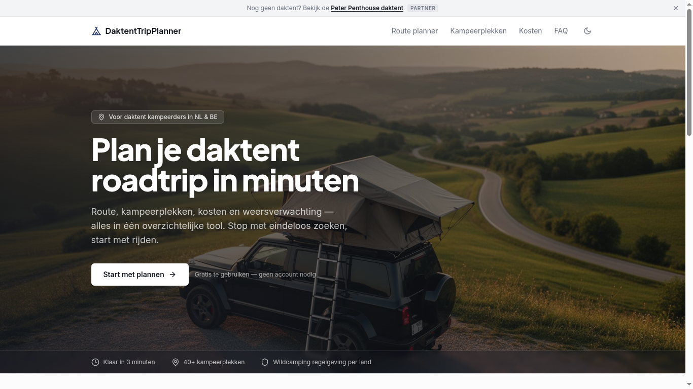
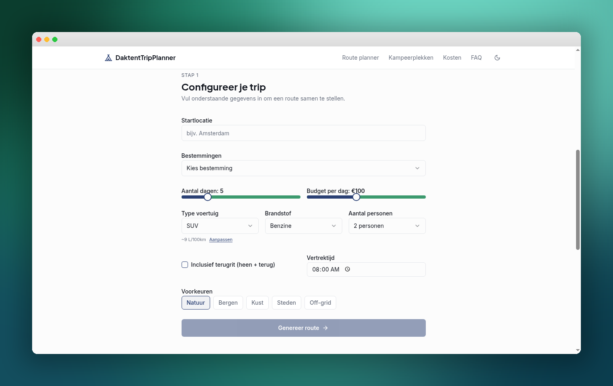
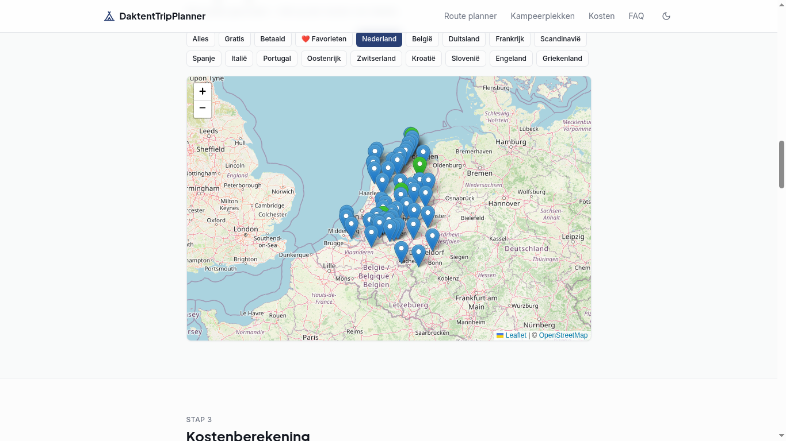
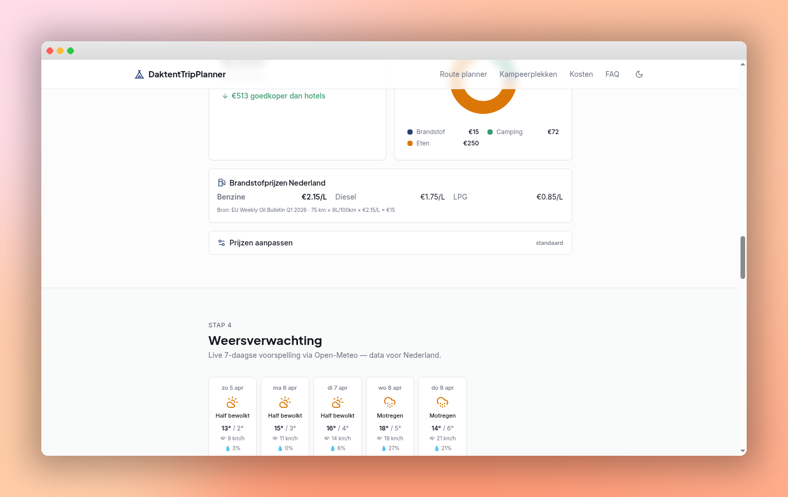

# 🏕️ DaktentTripPlanner

[](https://benrgy.github.io/daktent-trip-planner/)
[](https://react.dev)
[](https://www.typescriptlang.org/)
[]()

> **Plan je perfecte daktent roadtrip in 3 minuten** — 40+ kampeerplekken, kosten, weer en inpaklijst in één gratis tool.

DaktentTripPlanner is dé gratis Nederlandstalige web-app voor daktent kampeerders en rooftop tent enthousiastelingen. Plan een complete roadtrip door Europa met interactieve kaart, realtime kostenberekening, weersverwachting en een slimme inpakchecklist — zonder account, volledig gratis.

---

## 📸 Screenshots

<!-- Voeg screenshots toe in /public/screenshots/ en update de paden hieronder -->

| Hero | Route Planner | Kampeerkaart | Kostenberekening |
|:---:|:---:|:---:|:---:|
|  |  |  |  |

---

## ✨ Features

| Feature | Beschrijving |
|---|---|
| 🗺️ **Route Planner** | Configureer vertrekplaats, bestemming, reisduur en reisgezelschap |
| 📍 **Kampeerplekken Kaart** | 40+ Europese locaties met filters (gratis/betaald, per land) inclusief wildcamping regelgeving |
| 💰 **Kostenberekening** | Automatische schatting van brandstof, camping, eten en tolkosten per trip |
| 🌦️ **Weersverwachting** | Actueel weerbericht per bestemming zodat je voorbereid op pad gaat |
| ✅ **Inpakchecklist** | Categorieën: daktent essentials, keuken, kleding, EHBO, documenten — met seizoens- en bestemmingsfilters |
| 📄 **PDF Export** | Download je complete tripoverzicht als PDF met route, kosten en paklijst |

---

## 🌍 Ondersteunde landen (12)

🇳🇱 Nederland · 🇧🇪 België · 🇩🇪 Duitsland · 🇫🇷 Frankrijk · 🇳🇴 Noorwegen · 🇸🇪 Zweden · 🇪🇸 Spanje · 🇮🇹 Italië · 🇵🇹 Portugal · 🇦🇹 Oostenrijk · 🇨🇭 Zwitserland · 🇭🇷 Kroatië · 🇸🇮 Slovenië

---

## 🚀 Aan de slag

### Online gebruiken

Ga naar **[benrgy.github.io/daktent-trip-planner](https://benrgy.github.io/daktent-trip-planner/)** — geen account nodig.

1. Vul je vertrekplaats en bestemming in
2. Kies reisduur en aantal personen
3. Genereer je route — krijg kampeerplekken, kosten en weer in één overzicht

### Lokaal draaien

```bash
git clone https://github.com/Benrgy/daktent-trip-planner.git
cd daktent-trip-planner
npm install
npm run dev
```

Open [http://localhost:5173](http://localhost:5173) in je browser.

---

## 🛠️ Tech Stack

| Technologie | Gebruik |
|---|---|
| [React 18](https://react.dev) | UI framework |
| [TypeScript 5](https://www.typescriptlang.org) | Type-safe development |
| [Vite 5](https://vitejs.dev) | Build tool & dev server |
| [Tailwind CSS 3](https://tailwindcss.com) | Styling |
| [Leaflet](https://leafletjs.com) | Interactieve kaart |
| [shadcn/ui](https://ui.shadcn.com) | UI componenten |
| [jsPDF](https://github.com/parallax/jsPDF) | PDF export |
| [Recharts](https://recharts.org) | Data visualisatie |

---

## 🤖 AI & SEO

Dit project is geoptimaliseerd voor zoekmachines en AI-modellen:

- Gestructureerde data (JSON-LD) voor WebApplication
- `robots.txt` met toegang voor AI-bots
- `llms.txt` voor AI-crawlers — [bekijk hier](https://benrgy.github.io/daktent-trip-planner/llms.txt)

---

## 🔗 Links

- 🌐 **Live app**: [benrgy.github.io/daktent-trip-planner](https://benrgy.github.io/daktent-trip-planner/)
- 🤖 **llms.txt**: [bekijk](https://benrgy.github.io/daktent-trip-planner/llms.txt)

---

## 📄 Licentie

Dit project is open source. Bijdragen zijn welkom via pull requests.

---

*Gemaakt voor daktent kampeerders in Nederland, België en heel Europa. Rooftop tent roadtrip planning made easy.* 🏕️
